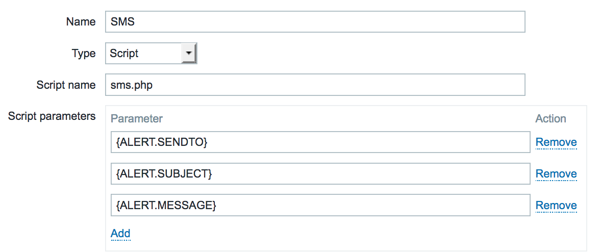

zabbix-sms-client
=================

Zabbix SMS alert script, using an internet gateway (Clickatell, Clockwork, Budgetsms, Infobip)

example:
./sms.php +3111122333 "Subject" "Message"

1. Move all file to your Zabbix AlertScripts path
2. chmod +x sms.php
3. copy `config.php.dist` to `config.php`, edit and uncomment the provider of your choice
4. In Zabbix admin go to Administration > Media Types add new media of type `Script` with script name `sms.php` with the following parameters
     - `{ALERT.SENDTO}`
     - `{ALERT.SUBJECT}`
     - `{ALERT.MESSAGE}`
5. In Zabbix GUI, go to Administration > Users, edit a user, make sure it has a mobile phone number and assign the new SMS media.

